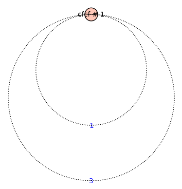

# automata-groups
My final project for course 3. 

-------------------------------------------------------------------
## Гіпотези / Твердження

#### Зупинки алгоритму

1. Алгоритм перевірки скінченності порядку елемента, що
    - спускається _тільки по вершині 0_ 
    - порівнює зустрічні елементи _як слова_
    - слова _не редукуються_ 
   
     завжди зупиняється. 
   
     __Неправда.__ Контрприклад: `abcfc`

2. Алгоритм перевірки скінченності порядку елемента, що 
    - спускається _тільки по вершині 0_
    - порівнює зустрічні елементи _як слова, з точністю до циклічних зсувів_
    - слова _не редукуються_ 
    
     завжди зупиняється.
   
     __Неправда.__ Контрприклад: `abcfc`
   

3. Алгоритм перевірки скінченності порядку елемента, що 
    - спускається _тільки по вершині 0_ 
    - порівнює зустрічні елементи _як слова, з точністю до циклічних зсувів_
    - слова _редукуються_
    
     завжди зупиняється.
   
     __Неправда.__ Контрприклад: `abcfc`

4. Алгоритм перевірки скінченності порядку елемента, що 
    - спускається _тільки по вершині 0_
    - порівнює зустрічні елементи _розв'язуючи проблему слів_
    - слова _редукуються_
    
    завжди зупиняється.
    
    __В процесі.__

5. Алгоритм перевірки скінченності порядку елемента, що 
    - спускається по всіх елементах _пошуком в ширину_
    - порівнює зустрічні елементи _як слова_
    - слова _не редукуються_
    
    завжди зупиняється.
   
    __В процесі.__ Поки наче зупиняється

#### Числові характеристики алгоритму

1. Для кожного слова довжини `n` алгоритм знаходить цикл 
    на глибині `O(n)`.
   
    __В процесі.__

#### Інше

1. Існують елементи нескінченного порядку, для яких множина 
   орбітальних станів скінченна, так ще й складається з одного
   елемента.
   
   __Приклад:__ `cfcf` 

2. Всі порядки - парні числа.

   __В процесі.__ Перевірено елементи довжини <= 7.

3. 