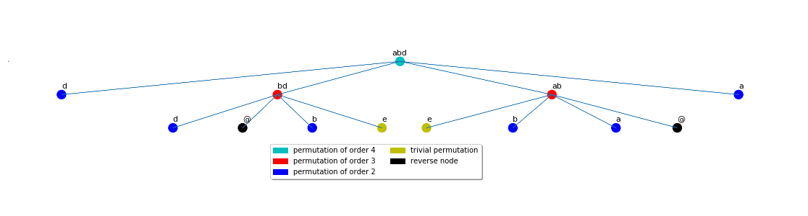

# automata-groups
My final project for course 3.

-------------------------------------------------------------------
## Гіпотези / Твердження

#### Зупинки алгоритму

1. Алгоритм перевірки скінченності порядку елемента, що
    - спускається _тільки по вершині 0_
    - порівнює зустрічні елементи _як слова_ / _як слова, з точністю
      до циклічних зсувів_ / _розв'язуючи проблему слів_
    - слова _не редукуються_ / _редукуються_

     завжди зупиняється.

     __Неправда.__ Контрприклад до всіх допустимих варіацій
    алгоритму: `abcfc = (0 3 1 2) (abc, bf, acfc, c)`
```
Generation: 1, name: abcfc
Generation: 2, name: acfcbfcabc
Generation: 3, name: acbacfbcabcacfcb
Generation: 4, name: abcfcfc
Generation: 5, name: acfcfcbfcabcfc
Generation: 6, name: acfcbfcfcfcfcacfbcabc
Generation: 7, name: acbfcabcabcacfcfcfcfcfcb
Generation: 8, name: abcabcabcacfcfbcfcfcfcfcfcfc
Generation: 9, name: acbacfbcfcfcabcabcabcacfcfcfcfcfcfcfcbacbacbfcfc
Generation: 10, name: abcfcacbacfcfcfbcabc
Generation: 11, name: acfcfcbacbfcacfcb
Generation: 12, name: acfcfbcfcfcabcacfcbacbacbacfbcfcfc
Generation: 13, name: acbfcabcacfcfcfcfbcfcfcabcabcfcfcfcacfbcabcfc
Generation: 14, name: abcabcacfcbfcabcabcfcacbacfcfcbacfbcfcfcfcacbacfcfcfcfcbacfcfcfcfcbfcfcfcfcfcfcacbfcabcabc
Generation: 15, name: acbacbacbfcacfcfcfcfcfcfbcfcfcfcfcfcfcabcabcabcabcabcacfcbacfcfcbacbfcabcfcfcfcfcacfcbfcfcacbacb
Generation: 16, name: abcabcacfcfbcfcfcabcabcabcabcabcacfcbacbacfcfcfcfcfbcabc
Generation: 17, name: acbacbfcabcabcabcabcabcacfcfbcabcabcabcacfcfcfcbacbacbacbacbacfcfcb
Generation: 18, name: abcfcfcfcfcfcfcabcabcacfcbacbacbacbacbacfcfcbacbacbacbacbacfbcabcabcabcacfcbacbacbacbacbacfbcabcabcabcabcabcabcacfcbacbacfbcabcabcfcfc
Generation: 19, name: acfcfcfcfcfcfcbacfbcabcabcfcfcabcabcabcabcabcabcacfcbacbacbacfbcabcabcabcfcfcfcfcabcabcacfcbacbacbacbacbacbacbacbacbacbacbacbacbacbacbfcabcfcfcabcabcacfcbacbacbacbacbacbacbacfbcabcabcfcfcabcfc
Generation: 20, name: acfcfbcfcacbacbacbacbacbacbacbacbacfcfcfcfcbacfbcabcabcabcabcabcabcabcabcfcfcabcabcabcabcabcabcfcacfcfcbacbacbfcabcabcabcabcabcabcacfcbacbfcfcfcabcabcabcabcabcabcabcfcacbacbacbacbacbacbacbacbacbacbfcabc
Generation: 21, name: acbfcabcabcabcabcfcfcfcfcabcabcabcabcabcabcabcabcabcfcacfbcabcabcabcabcabcabcabcacfcfcfcbacbacbacbfcabcabcabcabcabcabcacfcfcfcfbcfcacbacbacbfcfcfcabcfcfcabcfcacbacbacbacbacbacbacbacbacbacbacfbcabcabcabcabcacfcbacbacbacbacbacbfcabcabcabcabcabcabcacfcbacbacbacfbcfcacbacbacbacfcfcb
Generation: 22, name: abcabcabcabcabcfcacbacbacbacbacfcfcbacbacbacbacfbcabcfcfcfcfcfcacbacbacbfcabcfcacbacbacbacbacbacbacbacbacbacbacbacbacbacbacbacbacbacbacbacbacbacbacbacbacbacbfcabcacfcbacbacfcfcfcfcbacbacbacbacbfcfcfcfcfcabcabcabcabcabcabcabcabcacfcbfcabcfcacfcfcbfcabcabcabcabcabcfcfcabcabcabcabcabcabcabcabcabcacfcfcfcbacbacbacbfcfcacbacbacbacbacfcfcbacbacbacfcfcfcfcfcfcbfcabcabcabcabcabcabcabcabcabcabcabcacfcbacbacbacfbcabcfcacbacbacbacfbcfcfcabcabcabcabcabcabcabcabcabcabcabcabcabcabcabcabcabcacfcbacbacbacbacbacbacbacfbcabcabcfcacfcfcbacbacfbcabcabcfcfcabcabcabcabcfcfc
Generation: 23, name: acbacbacfcfcbacbacbacbacbacfcfcfcfcfcfcbfcabcabcabcabcabcabcabcabcabcabcabcabcabcabcacfcfbcabcabcfcacbacbacbacbacbacfcfcbacbacbacfcfcbacbacbacbacbacfbcabcfcacbacbacbacbacfbcabcfcfcfcfcfcfcfcfcabcabcabcabcabcfcacbacbacbacbacbacbacbacbacfbcabcabcabcfcacfbcabcabcabcfc
Generation: 24, name: abcacfcfcfcbacbacbacbacbacbacbacfbcabcabcabcabcabcfcfcabcacfcbfcabcabcfcfcfcacbacbacfcfcbacbfcfcacbacbacfbcabcabcfcfcfcfcfcfcfcfcfcacbacbacbacbacbacfbcabcfcfcabcabcabcabcabcabcabcabcfcfcfcacbacbacbacbacbacbacbacbacbacbacfcfcbacbfcabcfcfcabcabcacfcfbcabcabcabcabcabcabcabcabcabcabcabcabcabcabcacfcbacfcfcbacbacbacfbcabcabcfcacbacbacbacbacbacfcfcfcfcfcfcfcfcbacbacbfcabcabcabcabcfcacbacbacfcfcbacbacbacbacbacfcfcbacbacbacbacbacbacbacbacbacbfcabcabcacfcbacbacbacbacbacbacfcfcbfcfcfcabcabcabcabcabcabcabcabcabcabcabcabcabcabcabcabcabc
Generation: 25, name: acfcfcbacbacbfcabcacfcbacfcfcfcfcbacbfcabcfcfcfcfcabcabcabcabcfcfcabcabcabcabcabcfcfcabcabcfcfcfcfcacfcbacfcfcfcfcbacbacbacbacbfcabcfcfcabcabcacfcbacfbcabcabcacfcfcfcbacbacbacbacbacbacbacbacb
Generation: 26, name: acfcbacbacfcfcbfcfcacbacbacfcfcbacfcfcfcfcfbcfcfcfcfcabcabcfcacbacbacbacbacfbcabcabcabcabcfcfcabcfcfcacfcbacbacfcfcfcfcbacbacfcfcbacbacbfcabcabcfcacbacfcfcbfcabcabcacfcbacfcfcbacbacbacfbcfcfcfcfcabcabcfcacbacbfcabcabcabcabcabcfcfcacfcfbcabcabcabcfcfcabcabcabcacfcbacbacbacbacbacbacbacbacbacfbcabcabcacfcfbcfcfcabcabcabcabcfcacbfcfcfcacfcbacbacbacbacbacfcfcbacfbcfcfcfcfcabcabcabcabc
Generation: 27, name: acbacbacfbcabcacfcfbcfcacbfcabcabcfcacfcfcfbcacfcbacbacfbcabcabcabcabcfcfcfcfcacfcfcfcfcfcbacfcfcbacbacbfcacfcbacbfcabcabcabcacfcbacfbcfcacbfcacfcbacbfcfcfcabcfcfcfcacbacbacfbcfcfcfcfcfcfcabcabcabcabcabcabcabcabcabcfcacbacbacfcfcbacbacbacbfcacfcbacfbcfcfcabcabcfcacbfcabcabcabcabcabcabcfcfcfcacbacfbcabcabcabcabcfcfcfcacbacbfcfcacbacbacbacbacbacfbcfcfcabcabcabcabcacfcbfcabcfcfcacfcbfcfcacbacbacbacbacbacbacbfcabcfcfcabcfcfcfcfcabcfcfcabcfcacbacfbcabcabcacfcbacbacbacbfcfcacbacbacbacbacfcfcfbcabcabcabcfcfcabcabcabcabcabcabcabcacfcfcfcbacbacfcfcfcfcfbcabcabcfcfcabcfcacbacb
Generation: 28, name: abcabcabcacfcfcfcbacfcfcbacbacbacbacbacbfcfcfcfcfcfcfcacfcfbcfcfcabcabcacfcfcfcbfcabcabcfcfcabcabcabcabcabcabcabcabcabcabcacfcfbcfcacbfcfcfcabcabcabcabcabcfcacbacbfcabcabcabcfcfcfcacbfcabcabcabcfcacfcfcfcfcbfcabcabcfcfcabcabcabcabcacfcbacbfcabcabcabcabcabcabcabcacfcbacbacfcfcbacfcfcbfcabcabcfcfcfcacbacbfcfcfcfcfcabcfcfcacfcfbcfcfcabcfcfcabcabcabcabcacfcfcfcfbcfcacfcfcfcfcfcfcfcfcfcfcbacbacbacbacbfcabcfcfcabcabcacfcfcfcbacfcfcbacbacbacfcfcfcfcbacbacfcfcfcfcfcfcfcfcbacbacfbcabcfcfcfcacbacbacbacbacbacbacbacfcfcbfcfcacfcfcbacfbcabcfcacbacbacbacbacfbcabcabcabcfcfcfcfcabcfcfcfcfcfcacfcfcbacbfcfcacfbcacfcbacbacfcfcfcfcfcfcbacfbcabcacfcbacbacbacbfcfcfcabcfcfcabcfcfcfcacbacbacfbcabcfcfcabcfcacbacbacbacbfcabcfcfcabcabcabcabcfcacbacbacbacfcfcfbcabcabcabcabcabcfcfcabcfcacbacbacbacbacbacbacbfcabcabcfcfcfcacbacbacbacfcfcfbcabcabcfcacbacbacbacbacbacfbcabcabcabcacfcfbcabcabcabcabcabcfcacfcfcbacbacbacbacbacbacfbcfcacbacbacbfcabcfcacbacbacbfcfcacbacbacbacbacfcfcbacbacbacbacbacbfcabcabcabcabcabcabcabcabcabcfcacbacbacbacbfcabcfcacbacbacbacbacbacbfcabcabcabcabcacfcbfcacfcfcfcbfcabcfcacfcfcbfcabcabcabcacfcfcfcbacbacfcfcbacbacbacbacfbcacfcbacbfcabcabc
Generation: 29, name: acbacfcfcbacbacbacbacbacbfcfcacbfcabcabcacfcbacbfcabcabcabcabcabcabcabcabcabcabcacfcfcfcfcfcbacbacbfcabcabcabcabcfcacbacbacfcfcfbcabcabcfcfcabcabcabcabcabcabcabcabcacfcbacfbcabcabcfcacbacbfcfcacbfcabcfcfcfcfcfcacfcfcfcfcbfcabcabcacfcbacfbcabcfcfcfcfcabcfcfcfcfcfcfcfcfcabcfcfcabcabcabcacfcfcfcbacbacfcfcbacbfcfcfcacfcfcfcfbcacfcfbcfcfcabcabcfcacfcfcfcfcbfcabcabcabcfcacbacbfcabcacfcbacbacbfcabcabcabcabcabcabcabcfcacbacbacbacfbcabcabcabcabcabcfcfcfcacfbcabcabcabcabcabcabcabcabcabcabcacfcbacbacbacbacbfcabcabcabcabcabcabcfcfcfcfcfcfcfcacfbcabcabcabcacfcbacbacfbcabcabcacfcbacbacbacfbcfcfcabcabcabcfcfcacfcfcfcbacfcfcbacfcfcbacbacbacbacbacfbcabcfcacbacbacbacfcfcfcfcbacbfcfcfcfcfcfcacbacbacbacbacbacbacbacfbcacfcbacbfcabcfcfcabcfcfcfcacfcfcbacbacfcfcfcfcfcfcfbcabcabcabcfcfcfcfcacfcfbcacfcfcfcbfcabcabcabcabcfcfcfcacfbcfcacbacbacbacbacbacbacfcfcfcfcbfcfcacfbcfcacbacbacbacfcfcbacbacfbcabcfcacfcfcbfcabcabcabcfcacbacbacbacbacfcfcbacbacfcfcbacbacbacfcfcbfcabcabcabcfcfcabcacfcbacfcfcbacbacbacbacbacfcfcbacbacbacbacbacbacbfcabcfcacbacbacbfcabcabcfcfcabcabcabcabcabcabcabcabcabcabcabcabcabcabcfcacbacbacbacbacbacbacbacbacbacfbcabcacfcbacbacfbcacfcfbcfcfcfcfcacfcfcfcfcfcfcfcfbcfcfcfcfcfcacbacbacbacbacbacbfcfcacbacbacfcfcbacbfcabcabcabcabcacfcbacbfcabcabcabcabcacfcbacbacbacbacbacbacfbcfcfcfcfcabcfcacfcfcfbcfcacbacbacfbcacfcfcfcbacbacbacbacbacfcfcbacfcfcbacbacbacfcfcfcfcbacbacbacfcfcfcfcbfcfcfcabcabcabcabcabcabcabcabcfcacfcfcfcfcfcfcbacbfcfcfcabcfcfcfcfcfcfcabcabcacfcfcfcbfcabcfcacbacbacbacfcfcbfcabcabcabcfcacbacbacbacfbcabcabcabcabcabcfcacbacbacbacbacbacbacbacbfcabcabcfcfcfcacbacbacbacbacbacbacbacfbcabcabcabcabcabcacfcfcfcbfcabcfcacbacbacbacbacfbcabcabcfcacbacbacbacbacfcfcbacbacfbcacfcbacfcfcbacbacfcfcbacbacbacbacbacbacbacb
Generation: 30, name: abcfcfcabcabcabcabcabcabcacfcbacbacbacbacbacfcfcbacbacbacbacbfcabcfcfcfcacbacbacbacbacbacbacbfcabcabcabcfcfcfcfcfcfcfcfcabcabcfcacfcfcfcfcfcfcfcfcbfcabcabcabcacfcbacbacfbcfcacfbcacfcfcfcbacfcfcfbcabcabcabcabcfcfcabcfcacbacbacbacbacbacbacfcfcfcfcbacbacbacbacbacfbcabcabcabcabcabcabcabcabcfcfcabcabcabcabcacfcbacfbcabcfcacbacfcfcfcfcbacfbcabcabcfcacbacbacbacfcfcfcfcfcfcfcfcfbcfcacfcfcfcfcbacbacfcfcbacbacfcfcfcfcfbcacfcbacbacbfcabcabcabcabcacfcbfcfcacbacbacbacfbcabcabcacfcbacbfcabcabcfcfcabcfcfcabcacfcbacbfcabcacfcbacbacbacbacbacfbcabcabcabcabcabcabcabcabcfcacbacbacbacbacbacbacbacbacbacbacfbcabcacfcfcfcfcfcfcfcfbcfcfcabcabcabcabcacfcbacbacfbcfcfcabcabcabcfcfcabcacfcfcfcfcfcbacfbcabcfcfcfcfcabcacfcbfcabcabcabcabcabcabcabcabcacfcfbcfcacfcfcfcfcfcfcbacfcfcbfcabcacfcbacbfcabcabcabcabcabcabcabcabcabcabcabcfcfcabcabcabcabcabcabcabcabcabcacfcbacfcfcbacfcfcbacbacbacbacfbcacfcbacbacbacbacbacbfcfcfcabcabcabcabcabcabcabcabcabcabcabcacfcfbcabcabcabcabcabcabcacfcbacfcfcbacbacbacbacfbcfcacbacbfcfcfcacfcbacbacbacbacfcfcfcfcbfcfcfcabcfcfcfcfcabcfcfcabcfcfcfcfcfcfcfcacbfcfcfcfcfcfcacbacbacfbcabcabcabcabcabcabcabcabcabcabcfcfcfcfcabcabcfcfcfcacbacbacfbcabcabcabcacfcfcfcbacbfcacfcbacfbcfcfcabcabcabcabcabcabcfcfcfcfcabcfcfcabcabcabcabcacfcbfcabcfcacfbcacfcfbcabcabcabcfcacbacfbcabcabcabcabcfcacbfcabcabcabcfcfcfcfcfcacbfcabcacfcbfcfcfcfcacbacbacbacbacfbcacfcbacbacfcfcbacbacfbcabcabcfcfcabcabcabcfcacbacbacbacbfcabcabcabcabcabcabcabcabcabcabcabcabcabcabcabcabcabcabcabcfcfcabcfcfcfcfcacfcfcfcfcfcfcfcfcfcfcfcbacbacbacbacbacbacbacbacbacbacbacbacbacbacbfcfcacfbcabcabcacfcbacbacbacbacbacfbcfcfcabcacfcbacbacbacfcfcfcfcbacbacbacbacfcfcfcfcfcfcbfcfcacbacfbcabcabcabcfcfcfcacbacbacbacbacbacbacfcfcbacfcfcfcfcbacbacbacfbcabcabcabcabcabcabcabcabcacfcfbcfcfcabcfcfcabcabcabcabcacfcfcfcbacfbcfcfcfcfcfcfcabcfcacbacbacfbcabcabcfcfcabcabcabcabcfcacbacfcfcfcfcfcfcfbcabcabcacfcbfcfcfcfcacfcfcbacbacfbcacfcfcfcfcfcfbcfcacfcfcbacbfcabcabcacfcbacbacbacbfcabcabcabcabcabcabcabcfcacbacbacbacbacbacbacbacbacbacbacbacbacbacbfcfcfcfcfcabcfcfcabcabcfcacfbcfcfcacfcbfcabcacfcbacbfcfcacbacbacbacbacbacbacbacbacbacbacfcfcbfcacfcfcfcbacbfcfcfcfcfcfcfcfcfcfcacbacbacbacbacbacbacfcfcfcfcfcfcbacbacbacfcfcbacbacfcfcbacbacfbcabcfcfcfcacfbcfcfcabcabcacfcbfcabcfcacbacbacbacbacbacbacbfcabcabcabcabcabcabcacfcfbcfcacfcfcbfcfcacbacbacbacbacbacbfcabcfcfcabcabcabcabcabcacfcbacbacfbcabcabcabcfcacfcfcbfcabcfcfcfcfcabcabcacfcbacbacbacfcfcfbcfcacfcfcbacbfcabcfcfcabcabcacfcbacfcfcbacbacfcfcbacbacbfcabcabcabcabcabcabcfcacbacbacbacbacbacbacbacbacbacbacfcfcbfcabcabcfcacbacbacbacbacfbcabcacfcbacbacfbcabcabcabc
Generation: 31, name: acfcfcbacbacbacfbcabcabcfcfcabcabcfcfcabcabcabcfcfcfcacbfcfcfcfcfcfcfcfcfcfcfcabcfcacbacfbcfcfcfcacfcfcfbcabcabcfcacbacbacbacbacfcfcfbcfcacbacbacbacfcfcfbcacfcbacbacfbcacfcbacbacbacbacbacbacbfcabcabcabcabcacfcbacfcfcbfcabcacfcbacbacbacbacbacbacbacbacbacbacbfcabcabcabcabcabcfcfcfcfcfcfcfcfcfcacbacbacbacbacbfcabcabcabcfcfcfcfcfcfcabcabcfcacfbcabcabcabcabcabcabcabcabcacfcfcfcfcfcbacfbcfcacbacbacbacbacfbcfcfcacfcfbcabcabcfcacbacbacbacbacbacfbcabcabcabcabcabcabcacfcbacbacbacbacbfcabcfcfcabcabcfcfcfcfcfcacfcfcfcfcbfcabcfcfcabcfcfcabcfcfcabcabcfcacbacbacbacbacfcfcfbcfcacbacbacbfcfcacbacbacbacfcfcfbcabcabcabcabcfcacbacbacfcfcfcfcfcfcbacbfcabcabcabcacfcbacbacbacbfcabcabcabcabcabcfcacfcfcfcfcfcfcfcfcbacbacbacbacbacbacbacbacbacbacbacbacbacbacbfcfcfcabcabcabcfcfcabcacfcbacbacbacbacfcfcbfcabcabcabcabcfcacbacbacbacbacbacbacfbcfcfcfcfcabcabcabcabcabcabcabcabcabcabcacfcfcfcbfcabcabcabcabcacfcbacbfcfcacfcfcbacfcfcbacbacfcfcfcfcbacfbcfcacfbcabcacfcfbcacfcbacfbcabcfcacbacbacbacbacbacbacbacbacbacbacbacbacbacbfcfcacbfcfcacbacfbcfcacbacbacbacbacbacbacbacbacbacbacfbcacfcbacbfcfcfcabcabcabcacfcfbcabcfcfcabcfcfcabcfcfcfcacbacbacfcfcbacbacbacfbcacfcfcfcbfcabcabcabcabcabcacfcbacbfcfcfcfcfcabcabcacfcbfcfcfcabcabcfcfcacfcbacbacbacbacbacbfcabcabcabcabcabcfcfcfcacbacbacbacbacbacfbcabcabcabcabcabcfcfcabcabcacfcbfcabcabcabcabcabcabcabcfcfcfcacfcfcfbcabcabcabcacfcfcfcfcfcbacbacbfcabcabcabcabcacfcbacbacbacbacbacbacbacbacbacbfcabcabcabcabcacfcbfcacfcbacbacbfcabcacfcfcfcfcfcfbcacfcfbcacfcbacbacfbcabcabcfcfcabcabcabcfcacfbcfcfcabcabcabcabcabcabcabcabcabcabcabcabcabcabcabcabcabcabcacfcfcfcfcfcbacbacfbcabcfcacfcfcbacbacfcfcfcfcbacbacbacbacbacbacbfcfcfcfcfcfcfcacfcbacbacbacbacbacbacbacbacfcfcbacbacbacbacbacbacfbcfcfcabcabcfcfcabcabcabcfcfcfcfcacfcfcfcfcfcfbcabcacfcbfcabcfcacfcfcbfcfcfcfcfcabcabcabcabcabcabcabcabcabcabcabcabcfcacbfcabcabcabcabcabcacfcbacbacbacbfcabcabcabcabcabcabcfcacfcfcbacbacfbcabcabcacfcbacbfcabcabcabcabcabcabcabcabcabcfcfcfcfcfcfcabcabcfcfcabcfcfcabcfcacbacfcfcbacbacbacbacbacbacbacbacbacbfcabcfcacfcfcfcfcfcfcbacfbcabcabcfcacfbcabcfcfcfcfcabcabcfcfcfcfcfcfcfcacbacbacbacfcfcfcfcbacfcfcbacbacbacbacfbcfcacbacbacfbcfcfcfcacbacbacbacbfcabcabcabcabcabcfcfcfcfcfcfcfcfcfcfcfcfcabcfcfcfcfcfcfcfcacfbcfcfcabcabcabcabcabcabcabcabcabcabcabcabcabcabcabcabcfcfcabcfcacbfcacfcbacbacbfcabcabcabcabcabcfcfcfcfcfcfcabcfcfcfcacbacbacbacbacbacbacfcfcbacbacbacfbcacfcbfcabcfcfcfcacbacbacbacbacbacbacbacbacbacbacbfcfcfcfcacbacbacbacbacbacbacfcfcbacbacbacbacbacbacbacfcfcbacfcfcfcfcbacfbcabcfcfcfcacfbcfcacbacbacfbcacfcbacbacbacfcfcbacbfcabcabcfcfcabcfcacbacbacbacbacbacbacbacbacfbcabcabcabcfcacbacbacbacbacbacbacbacbacfcfcfcfcfcfcfcfcbacfcfcfcfcbacbacfbcabcabcacfcbacfbcabcabcabcabcfcacbacbacbacbacbacbacfcfcbacbacbacbacfcfcbacbacfbcfcacbacfcfcbacfcfcfcfcbfcfcfcfcfcabcfcfcabcfcfcfcfcfcfcabcfcfcfcacbacbacbacbacbacbacbacbfcabcfcfcabcabcacfcbacbacbacbacfcfcbacfcfcbfcabcabcabcabcacfcfcfcbacbfcabcacfcfbcfcfcabcacfcbacbacbacbacfbcacfcfbcfcfcfcfcabcabcabcabcabcabcabcabcabcabcabcabcfcfcacfcbacbacbacbacbacbacbacbacbacbacbfcabcabcabcabcabcabcabcabcabcabcabcacfcbacbacbacfbcfcfcabcabcfcacbacbfcacfcfbcfcfcabcfcfcfcacbfcfcacbacbacbacbacbacbacbacbfcfcfcabcfcfcfcfcabcacfcfcfcbacbacbacfcfcfcfcbfcabcabcabcabcacfcbfcfcfcfcacbacbacbacbfcfcfcabcabcacfcfcfcfcfcfbcacfcbacfcfcbacbfcabcabcabcabcabcabcabcabcabcabcabcabcabcabcabcabcabcabcabcabcabcfcfcacfcfcfcfbcabcabcabcabcabcabcabcabcabcabcacfcfcfcbacbacbacbacfcfcfcfcfcfcbacbfcabcabcabcacfcfbcabcfcfcfcacfcfcbacbacfcfcfcfcfcfcfcfcbfcabcfcacbacbfcacfcfbcabcabcacfcfcfcfcfcbacbacbacfcfcfcfcbacbacbacbacbacbacbacbacbacbacfcfcfcfcfcfcbfcabcabcabcfcfcfcfcabcabcabcabcabcabcacfcfcfcfcfcfcfcfcfcfcfcfcfcfcfcbacbacfbcabcabcfcacbfcabcabcacfcbfcabcabcabcfcfcfcacfbcabcabcabcfcacbacbacfbcabcabcabcabcacfcbfcfcfcabcacfcfcfcbacbacfcfcbacfbcfcfcabcfcfcabcfcacbacbacbacbacbacbacbacbacbacbacfbcabcabcabcabcabcabcacfcbacb
...
(up to 41 generation with the last word of 40323 letters)
```


2. Алгоритм перевірки скінченності порядку елемента, що
   - спускається _тільки по основних гілках_ (тобто
     завжди по 0 + завжди по 1 + завжди по 2 + завжди по 3)
     _пошуком в ширину_
   - порівнює зустрічні елементи _як слова_ / _як слова, з точністю
     до циклічних зсувів_ / _як елементи групи_
   - слова не редукуються / редукуються

   завжди зупиняється.

   __Неправда.__ Для не редукованих слів контрприкладом є `abcf = (0 2)(1 3) (bf, abc, acf, e)`,
   для редукованих - `abcfg = (0 1 3 2) (e, abcg, acfg, bf)`

   __Що цікаво,__ для `abcfc = (0 3 1 2) (abc, bf, acfc, c)` зупиняється при будь-яких налаштуваннях.


3. Алгоритм перевірки скінченності порядку елемента, що
    - спускається по всіх елементах _пошуком в ширину_
    - порівнює зустрічні елементи _як слова_
    - слова _не редукуються_

    завжди зупиняється.

    __В процесі.__ Поки наче зупиняється


4. В дереві елемента скінченного порядку є тільки елементи 
   скінченного порядку 
   
   __Неправда.__ Контрприклад: `abd = (0 1 2 3) (d, bd, ab, a)`



#### Доведення зупинки

1. Не існує елемента з підстановкою порядку 4, у якого після піднесення
до 4 степення теж виникає елемент з підстановкою порядку 4.

__Доведення__
Якщо маємо елемент $w = \sigma (w_0, w_1, w_2, w_4)$, де $\sigma$ - цикл довжини
4, то $w^4 = () (s_0, s_1, s_2, s_3)$, де $s_i$ є комбінацією всіх елементів $w_i$,
$|s_i| = 2 * |w|$ - число парне, а отже підстановка буде складатись з парної
к-ті циклів парної довжини, а отже не є циклом довжини 4.


#### Числові характеристики алгоритму

1. Для кожного слова довжини `n` алгоритм знаходить цикл
    на глибині `O(n)`.

    __В процесі.__


#### Інше

1. Існують елементи нескінченного порядку, для яких множина
   орбітальних станів скінченна, так ще й складається з одного
   елемента.

   __Приклад:__ `cfcf = (0 3 1) (cf, c, cfcf, f)`


2. Всі порядки - парні числа.

   __В процесі.__ Перевірено елементи довжини <= 7.
